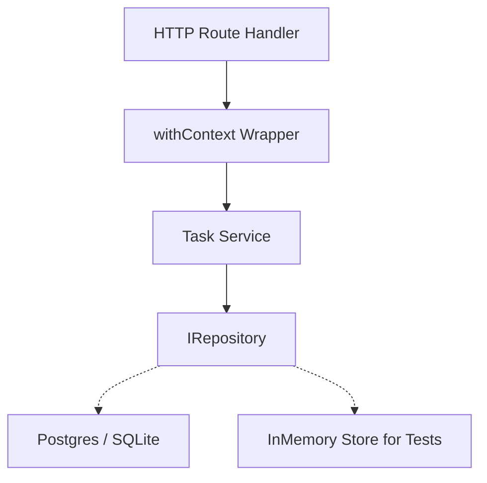

# Layered Next.js API

A reference Next.js API utilizing clean architecture principles. It cleanly separates the Domain, Repository, Service, and HTTP layers.

## Features

- **Domain:** Zod schemas and TypeScript types defining entities (e.g. `Task`).
- **Repositories:** `IRepository` interface for Dependency Injection, enabling 100% in-memory testability.
- **Services:** Pure business logic.
- **HTTP Context:** `withContext` wrapper providing auth checking and standardized error handling.
- **Optimistic Concurrency:** Handles `prev_updated_at` checks natively, returning HTTP 409 Conflicts.
- **Idempotency:** A generic store wrapper to prevent duplicate execution of POST/PATCH mutations.

## Architecture



## Quick Start

```typescript
import { TaskService, InMemoryRepository } from "layered-nextjs-api";

// Dependency injection
const repo = new InMemoryRepository();
const service = new TaskService(repo);

// Example business logic
await service.createTask({
  id: "uuid-1",
  title: "Setup clean architecture",
  status: "todo",
  workspace_id: "ws-1"
});

// Handles concurrency out of the box
try {
  await service.completeTask("uuid-1", "old-timestamp-from-client");
} catch (e) {
  // ConcurrencyError (HTTP 409)
}
```

## License
MIT

